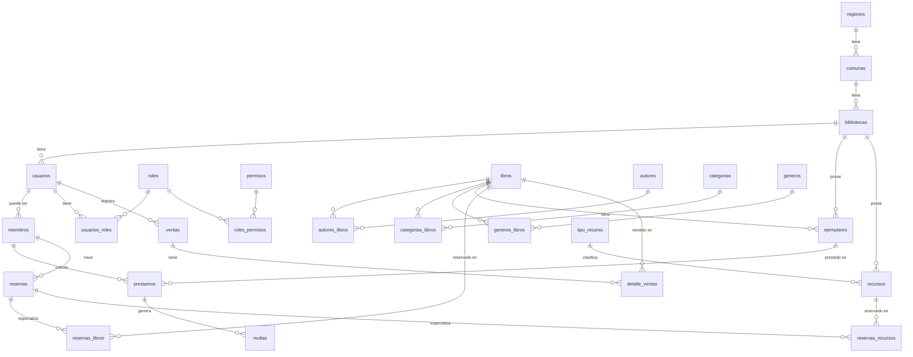

# Modelo de Base de Datos — Sistema de Biblioteca

---

## Índice

1. [Descripción por tabla](#descripción-por-tabla)
2. [Decisiones de diseño](#decisiones-de-diseño)
3. [Diagrama de relaciones](#diagrama-de-relaciones)
4. [DDL completo](#ddl-completo)

---

## Descripción por tabla

### Geografía

#### `regiones`
Contenedor geográfico de más alto nivel.

| Columna | Tipo | Restricciones | Descripción |
|---|---|---|---|
| id_region | INT | PK, IDENTITY | Identificador único |
| nombre | TEXT | NOT NULL | Nombre de la región |

#### `comunas`
Unidad geográfica que agrupa bibliotecas. Pertenece a una región.

| Columna | Tipo | Restricciones | Descripción |
|---|---|---|---|
| id_comuna | INT | PK, IDENTITY | Identificador único |
| id_region | INT | FK → regiones | Región a la que pertenece |
| nombre | TEXT | NOT NULL | Nombre de la comuna |

---

### Biblioteca

#### `bibliotecas`
Entidad central de operación física. Todo usuario, ejemplar y recurso pertenece a una biblioteca.

| Columna | Tipo | Restricciones | Descripción |
|---|---|---|---|
| id_biblioteca | INT | PK, IDENTITY | Identificador único |
| nombre | TEXT | NOT NULL | Nombre de la biblioteca |
| fecha | DATE | NOT NULL | Fecha de creación |
| id_comuna | INT | FK → comunas | Ubicación geográfica |
| direccion | TEXT | NOT NULL | Dirección física |

---

### Catálogo

#### `libros`
Título lógico. Representa el libro como obra, no como objeto físico.

| Columna | Tipo | Restricciones | Descripción |
|---|---|---|---|
| id_libro | INT | PK, IDENTITY | Identificador único |
| titulo | TEXT | NOT NULL | Título del libro |
| ISBN | VARCHAR(17) | NULL | Código ISBN |

#### `autores`
Personas que escribieron uno o más libros.

| Columna | Tipo | Restricciones | Descripción |
|---|---|---|---|
| id_autor | INT | PK, IDENTITY | Identificador único |
| nombre | TEXT | NOT NULL | Nombre del autor |

#### `autores_libros`
Tabla de unión N:M entre libros y autores.

| Columna | Tipo | Restricciones | Descripción |
|---|---|---|---|
| id_autlibros | INT | PK, IDENTITY | Identificador único |
| id_libro | INT | FK → libros | Libro relacionado |
| id_autor | INT | FK → autores | Autor relacionado |

#### `categorias`
Clasificación temática de los libros.

| Columna | Tipo | Restricciones | Descripción |
|---|---|---|---|
| id_categoria | INT | PK, IDENTITY | Identificador único |
| nombre | TEXT | NOT NULL | Nombre de la categoría |

#### `categorias_libros`
Tabla de unión N:M entre libros y categorías.

| Columna | Tipo | Restricciones | Descripción |
|---|---|---|---|
| id_catlibros | INT | PK, IDENTITY | Identificador único |
| id_libro | INT | FK → libros | Libro relacionado |
| id_categoria | INT | FK → categorias | Categoría relacionada |

#### `generos`
Clasificación de género literario de los libros.

| Columna | Tipo | Restricciones | Descripción |
|---|---|---|---|
| id_genero | INT | PK, IDENTITY | Identificador único |
| nombre | TEXT | NOT NULL, UNIQUE | Nombre del género |

#### `generos_libros`
Tabla de unión N:M entre libros y géneros.

| Columna | Tipo | Restricciones | Descripción |
|---|---|---|---|
| id_genlib | INT | PK, IDENTITY | Identificador único |
| id_libro | INT | FK → libros | Libro relacionado |
| id_genero | INT | FK → generos | Género relacionado |

---

### Inventario físico

#### `ejemplares`
Copia física de un libro. Es la unidad real que se presta. La cantidad disponible de un título se calcula contando sus ejemplares con estado `disponible`.

| Columna | Tipo | Restricciones | Descripción |
|---|---|---|---|
| id_ejemplar | INT | PK, IDENTITY | Identificador único |
| id_libro | INT | FK → libros | Título al que pertenece |
| id_biblioteca | INT | FK → bibliotecas | Biblioteca que lo posee |
| barcode | TEXT | NOT NULL, UNIQUE | Código de barras físico (Barcode 128) |
| estado | TEXT | NOT NULL | disponible / prestado / dañado / perdido |

---

### Usuarios y acceso

#### `usuarios`
Cuenta del sistema. Puede ser bibliotecario, vendedor u otro rol. Pertenece a una biblioteca.

| Columna | Tipo | Restricciones | Descripción |
|---|---|---|---|
| id_usuario | INT | PK, IDENTITY | Identificador único |
| nombre | TEXT | NOT NULL | Nombre completo |
| email | TEXT | NOT NULL | Correo electrónico |
| fecha_registro | DATE | NOT NULL | Fecha de creación de la cuenta |
| id_biblioteca | INT | FK → bibliotecas | Biblioteca a la que pertenece |

#### `miembros`
Perfil de membresía de un usuario. No todo usuario es miembro. Un miembro siempre tiene un usuario asociado.

| Columna | Tipo | Restricciones | Descripción |
|---|---|---|---|
| id_miembro | INT | PK, IDENTITY | Identificador único |
| id_usuario | INT | FK → usuarios | Usuario asociado |
| barcode | TEXT | NOT NULL, UNIQUE | Código de barras del carnet (Barcode 128) |
| estado | TEXT | NOT NULL | activo / suspendido / vencido |
| fecha_miembro | DATE | NOT NULL | Fecha de inicio de membresía |

#### `roles`
Agrupador de permisos. Un usuario puede tener múltiples roles.

| Columna | Tipo | Restricciones | Descripción |
|---|---|---|---|
| id_role | INT | PK, IDENTITY | Identificador único |
| nombre | TEXT | NOT NULL, UNIQUE | Nombre del rol |

#### `permisos`
Acción o recurso autorizado. Se asigna a roles, no directamente a usuarios.

| Columna | Tipo | Restricciones | Descripción |
|---|---|---|---|
| id_permiso | INT | PK, IDENTITY | Identificador único |
| nombre | TEXT | NOT NULL, UNIQUE | Nombre del permiso |

#### `usuarios_roles`
Tabla de unión N:M entre usuarios y roles.

| Columna | Tipo | Restricciones | Descripción |
|---|---|---|---|
| id_userrol | INT | PK, IDENTITY | Identificador único |
| id_usuario | INT | FK → usuarios | Usuario relacionado |
| id_role | INT | FK → roles | Rol relacionado |

#### `roles_permisos`
Tabla de unión N:M entre roles y permisos.

| Columna | Tipo | Restricciones | Descripción |
|---|---|---|---|
| id_rolpermisos | INT | PK, IDENTITY | Identificador único |
| id_role | INT | FK → roles | Rol relacionado |
| id_permiso | INT | FK → permisos | Permiso relacionado |

---

### Circulación

#### `prestamos`
Registra el préstamo de un ejemplar físico a un miembro.

| Columna | Tipo | Restricciones | Descripción |
|---|---|---|---|
| id_prestamo | INT | PK, IDENTITY | Identificador único |
| id_miembro | INT | FK → miembros | Miembro que solicita el préstamo |
| id_ejemplar | INT | FK → ejemplares | Ejemplar físico prestado |
| fecha_prestamo | DATE | NOT NULL | Fecha de inicio del préstamo |
| fecha_devolucion | DATE | NOT NULL | Fecha esperada de devolución |
| fecha_devolucion_real | DATE | NULL | Fecha real de devolución |
| estado | TEXT | NOT NULL | activo / devuelto / vencido |

#### `multas`
Se genera cuando un préstamo se devuelve fuera de plazo.

| Columna | Tipo | Restricciones | Descripción |
|---|---|---|---|
| id_multa | INT | PK, IDENTITY | Identificador único |
| id_prestamo | INT | FK → prestamos | Préstamo que originó la multa |
| monto | NUMERIC(10,2) | NOT NULL | Monto de la multa |
| estado | TEXT | NOT NULL | pendiente / pagada |

---

### Reservas

Las reservas usan herencia de tabla: `reservas` es la tabla madre con atributos comunes, y `reservas_libros` / `reservas_recursos` son las especializaciones.

#### `reservas`
Tabla madre. Contiene los atributos comunes a cualquier tipo de reserva.

| Columna | Tipo | Restricciones | Descripción |
|---|---|---|---|
| id_reserva | INT | PK, IDENTITY | Identificador único |
| id_miembro | INT | FK → miembros | Miembro que reserva |
| fecha | DATE | NOT NULL | Fecha de la reserva |
| estado | TEXT | NOT NULL | pendiente / confirmada / cancelada |

#### `reservas_libros`
Especialización para reserva de un título bibliográfico.

| Columna | Tipo | Restricciones | Descripción |
|---|---|---|---|
| id_reserva_libro | INT | PK, IDENTITY | Identificador único |
| id_reserva | INT | FK → reservas | Reserva base |
| id_libro | INT | FK → libros | Libro reservado |
| fecha_expiracion | DATE | NOT NULL | Hasta cuándo es válida la reserva |

#### `reservas_recursos`
Especialización para reserva de un espacio o recurso físico.

| Columna | Tipo | Restricciones | Descripción |
|---|---|---|---|
| id_reserva_recurso | INT | PK, IDENTITY | Identificador único |
| id_reserva | INT | FK → reservas | Reserva base |
| id_recursos | INT | FK → recursos | Recurso reservado |
| fecha_inicio | TIMESTAMP | NOT NULL | Inicio de la reserva |
| fecha_fin | TIMESTAMP | NOT NULL | Fin de la reserva |

---

### Recursos no bibliográficos

#### `tipo_recurso`
Clasificador de recursos (sala, equipo, computador, etc.).

| Columna | Tipo | Restricciones | Descripción |
|---|---|---|---|
| id_tipo_recurso | INT | PK, IDENTITY | Identificador único |
| nombre | TEXT | NOT NULL | Nombre del tipo |

#### `recursos`
Elemento reservable que no es un libro. Pertenece a una biblioteca.

| Columna | Tipo | Restricciones | Descripción |
|---|---|---|---|
| id_recursos | INT | PK, IDENTITY | Identificador único |
| id_tipo_recurso | INT | FK → tipo_recurso | Tipo de recurso |
| id_biblioteca | INT | FK → bibliotecas | Biblioteca propietaria |
| nombre | TEXT | NOT NULL | Nombre del recurso |
| estado | TEXT | NOT NULL | disponible / ocupado / mantenimiento |

---

### Ventas

#### `ventas`
Registra una transacción de venta de libros. El total se calcula en el código desde los detalles.

| Columna | Tipo | Restricciones | Descripción |
|---|---|---|---|
| id_venta | INT | PK, IDENTITY | Identificador único |
| id_usuario | INT | FK → usuarios | Usuario que registra la venta |
| fecha | DATE | NOT NULL | Fecha de la transacción |

#### `detalle_ventas`
Línea de una venta. Asocia un libro con cantidad y precio al momento de la venta.

| Columna | Tipo | Restricciones | Descripción |
|---|---|---|---|
| id_detalle_venta | INT | PK, IDENTITY | Identificador único |
| id_venta | INT | FK → ventas | Venta a la que pertenece |
| id_libro | INT | FK → libros | Libro vendido |
| cantidad | INT | NOT NULL | Cantidad de unidades |
| precio_unitario | NUMERIC(10,2) | NOT NULL | Precio al momento de la venta |

---

## Decisiones de diseño

### `Libro` vs `Ejemplar`
El libro es el título lógico (la obra). El ejemplar es la copia física. La cantidad disponible de un título no se guarda como atributo — se calcula contando ejemplares con estado `disponible`. Esto evita inconsistencias entre un contador y el estado real del inventario.

### `Usuario` vs `Miembro`
Son entidades separadas por diseño. Un usuario es una cuenta del sistema (bibliotecario, vendedor, administrador). Un miembro es quien tiene carnet y puede pedir préstamos. Un usuario puede existir sin ser miembro, pero un miembro siempre tiene un usuario asociado. La FK vive en `miembros`, no en `usuarios`.

### Relaciones N:M explícitas
`autores_libros`, `categorias_libros` y `generos_libros` son tablas de unión explícitas con PK propia. Esto permite agregar atributos a la relación en el futuro sin cambiar el modelo.

### Herencia en reservas
`reservas` actúa como tabla madre con los atributos comunes. `reservas_libros` y `reservas_recursos` son especializaciones con sus propios atributos. Esto evita campos NULL opcionales en una sola tabla y mantiene integridad referencial en cada rama.

### Total en ventas
El campo `total` fue eliminado de `ventas` porque es un dato derivado. Se calcula en el código como `SUM(cantidad * precio_unitario)` desde `detalle_ventas`. Guardarlo como columna crea riesgo de inconsistencia si algún detalle cambia.

### Tipos de datos
- Fechas como `DATE` o `TIMESTAMP`, nunca `TEXT`
- Montos como `NUMERIC(10,2)` para soportar decimales en otras monedas
- Barcodes como `TEXT` porque son identificadores, no números — un `INT` truncaría ceros a la izquierda
- PKs con `GENERATED ALWAYS AS IDENTITY`, no `SERIAL`

### Geografía del usuario
`usuarios` no tiene `id_comuna` directamente. La comuna se deriva navegando `usuario → biblioteca → comuna`. La relación relevante para el negocio es a qué biblioteca pertenece el usuario, no en qué comuna vive.

---

## Diagrama de relaciones



---

## DDL completo

```sql
CREATE TABLE autores
(
  id_autor INT  NOT NULL GENERATED ALWAYS AS IDENTITY,
  nombre   TEXT NOT NULL,
  PRIMARY KEY (id_autor)
);

CREATE TABLE autores_libros
(
  id_autlibros INT NOT NULL GENERATED ALWAYS AS IDENTITY,
  id_libro     INT NOT NULL,
  id_autor     INT NOT NULL,
  PRIMARY KEY (id_autlibros)
);

CREATE TABLE bibliotecas
(
  id_biblioteca INT  NOT NULL GENERATED ALWAYS AS IDENTITY,
  nombre        TEXT NOT NULL,
  fecha         DATE NOT NULL,
  id_comuna     INT  NOT NULL,
  direccion     TEXT NOT NULL,
  PRIMARY KEY (id_biblioteca)
);

CREATE TABLE categorias
(
  id_categoria INT  NOT NULL GENERATED ALWAYS AS IDENTITY,
  nombre       TEXT NOT NULL,
  PRIMARY KEY (id_categoria)
);

CREATE TABLE categorias_libros
(
  id_catlibros INT NOT NULL GENERATED ALWAYS AS IDENTITY,
  id_libro     INT NOT NULL,
  id_categoria INT NOT NULL,
  PRIMARY KEY (id_catlibros)
);

CREATE TABLE comunas
(
  id_comuna INT  NOT NULL GENERATED ALWAYS AS IDENTITY,
  id_region INT  NOT NULL,
  nombre    TEXT NOT NULL,
  PRIMARY KEY (id_comuna)
);

CREATE TABLE detalle_ventas
(
  id_detalle_venta INT           NOT NULL GENERATED ALWAYS AS IDENTITY,
  id_venta         INT           NOT NULL,
  id_libro         INT           NOT NULL,
  cantidad         INT           NOT NULL,
  precio_unitario  NUMERIC(10,2) NOT NULL,
  PRIMARY KEY (id_detalle_venta)
);

CREATE TABLE ejemplares
(
  id_ejemplar   INT  NOT NULL GENERATED ALWAYS AS IDENTITY,
  id_libro      INT  NOT NULL,
  id_biblioteca INT  NOT NULL,
  barcode       TEXT NOT NULL UNIQUE,
  estado        TEXT NOT NULL,
  PRIMARY KEY (id_ejemplar)
);

CREATE TABLE generos
(
  id_genero INT  NOT NULL GENERATED ALWAYS AS IDENTITY,
  nombre    TEXT NOT NULL UNIQUE,
  PRIMARY KEY (id_genero)
);

CREATE TABLE generos_libros
(
  id_genlib INT NOT NULL GENERATED ALWAYS AS IDENTITY,
  id_libro  INT NOT NULL,
  id_genero INT NOT NULL,
  PRIMARY KEY (id_genlib)
);

CREATE TABLE libros
(
  id_libro INT          NOT NULL GENERATED ALWAYS AS IDENTITY,
  titulo   TEXT         NOT NULL,
  ISBN     VARCHAR(17),
  PRIMARY KEY (id_libro)
);

CREATE TABLE miembros
(
  id_miembro    INT  NOT NULL GENERATED ALWAYS AS IDENTITY,
  id_usuario    INT  NOT NULL,
  barcode       TEXT NOT NULL UNIQUE,
  estado        TEXT NOT NULL,
  fecha_miembro DATE NOT NULL,
  PRIMARY KEY (id_miembro)
);

COMMENT ON COLUMN miembros.barcode IS 'barcode_128';

CREATE TABLE multas
(
  id_multa    INT           NOT NULL GENERATED ALWAYS AS IDENTITY,
  id_prestamo INT           NOT NULL,
  monto       NUMERIC(10,2) NOT NULL,
  estado      TEXT          NOT NULL,
  PRIMARY KEY (id_multa)
);

CREATE TABLE permisos
(
  id_permiso INT  NOT NULL GENERATED ALWAYS AS IDENTITY,
  nombre     TEXT NOT NULL UNIQUE,
  PRIMARY KEY (id_permiso)
);

CREATE TABLE prestamos
(
  id_prestamo           INT  NOT NULL GENERATED ALWAYS AS IDENTITY,
  id_miembro            INT  NOT NULL,
  id_ejemplar           INT  NOT NULL,
  fecha_prestamo        DATE NOT NULL,
  fecha_devolucion      DATE NOT NULL,
  fecha_devolucion_real DATE,
  estado                TEXT NOT NULL,
  PRIMARY KEY (id_prestamo)
);

CREATE TABLE recursos
(
  id_recursos     INT  NOT NULL GENERATED ALWAYS AS IDENTITY,
  id_tipo_recurso INT  NOT NULL,
  id_biblioteca   INT  NOT NULL,
  nombre          TEXT NOT NULL,
  estado          TEXT NOT NULL,
  PRIMARY KEY (id_recursos)
);

CREATE TABLE regiones
(
  id_region INT  NOT NULL GENERATED ALWAYS AS IDENTITY,
  nombre    TEXT NOT NULL,
  PRIMARY KEY (id_region)
);

CREATE TABLE reservas
(
  id_reserva INT  NOT NULL GENERATED ALWAYS AS IDENTITY,
  id_miembro INT  NOT NULL,
  fecha      DATE NOT NULL,
  estado     TEXT NOT NULL,
  PRIMARY KEY (id_reserva)
);

CREATE TABLE reservas_libros
(
  id_reserva_libro INT  NOT NULL GENERATED ALWAYS AS IDENTITY,
  id_reserva       INT  NOT NULL,
  id_libro         INT  NOT NULL,
  fecha_expiracion DATE NOT NULL,
  PRIMARY KEY (id_reserva_libro)
);

CREATE TABLE reservas_recursos
(
  id_reserva_recurso INT       NOT NULL GENERATED ALWAYS AS IDENTITY,
  id_reserva         INT       NOT NULL,
  id_recursos        INT       NOT NULL,
  fecha_inicio       TIMESTAMP NOT NULL,
  fecha_fin          TIMESTAMP NOT NULL,
  PRIMARY KEY (id_reserva_recurso)
);

CREATE TABLE roles
(
  id_role INT  NOT NULL GENERATED ALWAYS AS IDENTITY,
  nombre  TEXT NOT NULL UNIQUE,
  PRIMARY KEY (id_role)
);

CREATE TABLE roles_permisos
(
  id_rolpermisos INT NOT NULL GENERATED ALWAYS AS IDENTITY,
  id_permiso     INT NOT NULL,
  id_role        INT NOT NULL,
  PRIMARY KEY (id_rolpermisos)
);

CREATE TABLE tipo_recurso
(
  id_tipo_recurso INT  NOT NULL GENERATED ALWAYS AS IDENTITY,
  nombre          TEXT NOT NULL,
  PRIMARY KEY (id_tipo_recurso)
);

CREATE TABLE usuarios
(
  id_usuario     INT  NOT NULL GENERATED ALWAYS AS IDENTITY,
  nombre         TEXT NOT NULL,
  email          TEXT NOT NULL,
  fecha_registro DATE NOT NULL,
  id_biblioteca  INT  NOT NULL,
  PRIMARY KEY (id_usuario)
);

CREATE TABLE usuarios_roles
(
  id_userrol INT NOT NULL GENERATED ALWAYS AS IDENTITY,
  id_usuario INT NOT NULL,
  id_role    INT NOT NULL,
  PRIMARY KEY (id_userrol)
);

CREATE TABLE ventas
(
  id_venta   INT  NOT NULL GENERATED ALWAYS AS IDENTITY,
  id_usuario INT  NOT NULL,
  fecha      DATE NOT NULL,
  PRIMARY KEY (id_venta)
);

ALTER TABLE comunas
  ADD CONSTRAINT FK_regiones_TO_comunas
    FOREIGN KEY (id_region) REFERENCES regiones (id_region);

ALTER TABLE bibliotecas
  ADD CONSTRAINT FK_comunas_TO_bibliotecas
    FOREIGN KEY (id_comuna) REFERENCES comunas (id_comuna);

ALTER TABLE generos_libros
  ADD CONSTRAINT FK_libros_TO_generos_libros
    FOREIGN KEY (id_libro) REFERENCES libros (id_libro);

ALTER TABLE generos_libros
  ADD CONSTRAINT FK_generos_TO_generos_libros
    FOREIGN KEY (id_genero) REFERENCES generos (id_genero);

ALTER TABLE categorias_libros
  ADD CONSTRAINT FK_libros_TO_categorias_libros
    FOREIGN KEY (id_libro) REFERENCES libros (id_libro);

ALTER TABLE categorias_libros
  ADD CONSTRAINT FK_categorias_TO_categorias_libros
    FOREIGN KEY (id_categoria) REFERENCES categorias (id_categoria);

ALTER TABLE autores_libros
  ADD CONSTRAINT FK_libros_TO_autores_libros
    FOREIGN KEY (id_libro) REFERENCES libros (id_libro);

ALTER TABLE autores_libros
  ADD CONSTRAINT FK_autores_TO_autores_libros
    FOREIGN KEY (id_autor) REFERENCES autores (id_autor);

ALTER TABLE usuarios_roles
  ADD CONSTRAINT FK_usuarios_TO_usuarios_roles
    FOREIGN KEY (id_usuario) REFERENCES usuarios (id_usuario);

ALTER TABLE usuarios_roles
  ADD CONSTRAINT FK_roles_TO_usuarios_roles
    FOREIGN KEY (id_role) REFERENCES roles (id_role);

ALTER TABLE roles_permisos
  ADD CONSTRAINT FK_permisos_TO_roles_permisos
    FOREIGN KEY (id_permiso) REFERENCES permisos (id_permiso);

ALTER TABLE roles_permisos
  ADD CONSTRAINT FK_roles_TO_roles_permisos
    FOREIGN KEY (id_role) REFERENCES roles (id_role);

ALTER TABLE usuarios
  ADD CONSTRAINT FK_bibliotecas_TO_usuarios
    FOREIGN KEY (id_biblioteca) REFERENCES bibliotecas (id_biblioteca);

ALTER TABLE miembros
  ADD CONSTRAINT FK_usuarios_TO_miembros
    FOREIGN KEY (id_usuario) REFERENCES usuarios (id_usuario);

ALTER TABLE ejemplares
  ADD CONSTRAINT FK_libros_TO_ejemplares
    FOREIGN KEY (id_libro) REFERENCES libros (id_libro);

ALTER TABLE ejemplares
  ADD CONSTRAINT FK_bibliotecas_TO_ejemplares
    FOREIGN KEY (id_biblioteca) REFERENCES bibliotecas (id_biblioteca);

ALTER TABLE prestamos
  ADD CONSTRAINT FK_miembros_TO_prestamos
    FOREIGN KEY (id_miembro) REFERENCES miembros (id_miembro);

ALTER TABLE prestamos
  ADD CONSTRAINT FK_ejemplares_TO_prestamos
    FOREIGN KEY (id_ejemplar) REFERENCES ejemplares (id_ejemplar);

ALTER TABLE multas
  ADD CONSTRAINT FK_prestamos_TO_multas
    FOREIGN KEY (id_prestamo) REFERENCES prestamos (id_prestamo);

ALTER TABLE reservas
  ADD CONSTRAINT FK_miembros_TO_reservas
    FOREIGN KEY (id_miembro) REFERENCES miembros (id_miembro);

ALTER TABLE reservas_libros
  ADD CONSTRAINT FK_reservas_TO_reservas_libros
    FOREIGN KEY (id_reserva) REFERENCES reservas (id_reserva);

ALTER TABLE reservas_libros
  ADD CONSTRAINT FK_libros_TO_reservas_libros
    FOREIGN KEY (id_libro) REFERENCES libros (id_libro);

ALTER TABLE recursos
  ADD CONSTRAINT FK_bibliotecas_TO_recursos
    FOREIGN KEY (id_biblioteca) REFERENCES bibliotecas (id_biblioteca);

ALTER TABLE recursos
  ADD CONSTRAINT FK_tipo_recurso_TO_recursos
    FOREIGN KEY (id_tipo_recurso) REFERENCES tipo_recurso (id_tipo_recurso);

ALTER TABLE reservas_recursos
  ADD CONSTRAINT FK_reservas_TO_reservas_recursos
    FOREIGN KEY (id_reserva) REFERENCES reservas (id_reserva);

ALTER TABLE reservas_recursos
  ADD CONSTRAINT FK_recursos_TO_reservas_recursos
    FOREIGN KEY (id_recursos) REFERENCES recursos (id_recursos);

ALTER TABLE ventas
  ADD CONSTRAINT FK_usuarios_TO_ventas
    FOREIGN KEY (id_usuario) REFERENCES usuarios (id_usuario);

ALTER TABLE detalle_ventas
  ADD CONSTRAINT FK_ventas_TO_detalle_ventas
    FOREIGN KEY (id_venta) REFERENCES ventas (id_venta);

ALTER TABLE detalle_ventas
  ADD CONSTRAINT FK_libros_TO_detalle_ventas
    FOREIGN KEY (id_libro) REFERENCES libros (id_libro);
```
