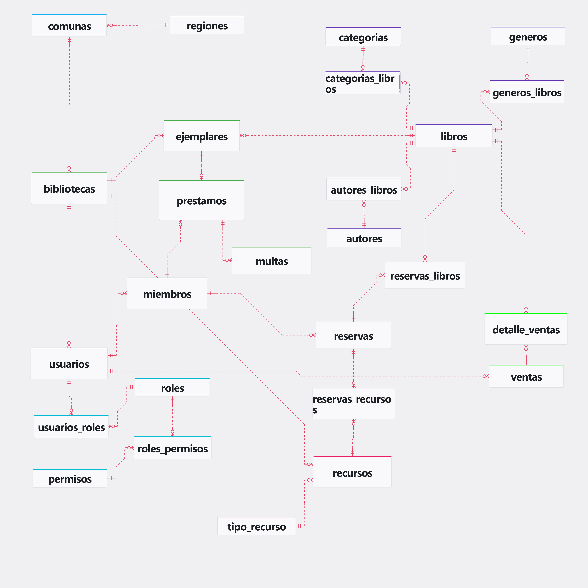

# Modelo de Base de Datos — Sistema de Biblioteca

---

## Índice

1. [Contexto del sistema](#contexto-del-sistema)
2. [Grupos funcionales](#grupos-funcionales)
3. [Descripción por tabla](#descripción-por-tabla)
4. [Decisiones de diseño](#decisiones-de-diseño)
5. [Diagrama de relaciones](#diagrama-de-relaciones)
6. [DDL completo](#ddl-completo)

---

## Contexto del sistema

Este modelo representa un sistema de gestión para una red de bibliotecas públicas distribuidas geográficamente a lo largo de Chile. No es una biblioteca única: el sistema contempla múltiples sedes, cada una con su propio inventario físico, personal y recursos reservables.

El modelo cubre cinco dominios operacionales:

- **Catálogo bibliográfico**: qué libros existen como obras (título, autores, géneros, categorías)
- **Inventario físico**: qué copias existen en qué sede y en qué estado
- **Circulación**: préstamos, devoluciones y multas por atraso
- **Reservas**: tanto de títulos bibliográficos como de espacios físicos (salas, equipos)
- **Ventas**: venta directa de libros al público, gestionada por usuarios del sistema

La separación entre estos dominios es intencional: permite que cada uno evolucione independientemente sin romper los demás.

---

## Grupos funcionales

El modelo se divide en siete grupos, cada uno con una responsabilidad clara:

| Grupo | Propósito |
|---|---|
| Geografía | Organizar las sedes por región y comuna |
| Biblioteca | Sede física como entidad operacional central |
| Catálogo | Representar los libros como obras lógicas |
| Inventario físico | Gestionar las copias reales de cada libro |
| Usuarios y acceso | Cuentas del sistema, membresías y permisos |
| Circulación | Préstamos, devoluciones y multas |
| Reservas | Reserva de títulos y recursos físicos |
| Recursos | Espacios y equipos reservables que no son libros |
| Ventas | Transacciones de venta al público |

---

## Descripción por tabla

### Geografía

El sistema opera en múltiples comunas del país. La jerarquía geográfica (`regiones → comunas → bibliotecas`) permite generar reportes territoriales (cuántas bibliotecas hay por región, qué comunas no tienen cobertura, etc.) sin depender de texto libre.

#### `regiones`

Contenedor geográfico de más alto nivel. Su único rol es agrupar comunas.

| Columna | Tipo | Restricciones | Descripción |
|---|---|---|---|
| id_region | INT | PK, IDENTITY | Identificador único |
| nombre | TEXT | NOT NULL | Nombre de la región |

#### `comunas`

Unidad geográfica que agrupa bibliotecas. Pertenece a una región.

| Columna | Tipo | Restricciones | Descripción |
|---|---|---|---|
| id_comuna | INT | PK, IDENTITY | Identificador único |
| id_region | INT | FK → regiones | Región a la que pertenece |
| nombre | TEXT | NOT NULL | Nombre de la comuna |

---

### Biblioteca

#### `bibliotecas`

Entidad central del sistema. Todo usuario, ejemplar y recurso pertenece a una biblioteca específica. La fecha de creación permite, por ejemplo, calcular antigüedad de la sede o filtrar reportes históricos.

| Columna | Tipo | Restricciones | Descripción |
|---|---|---|---|
| id_biblioteca | INT | PK, IDENTITY | Identificador único |
| nombre | TEXT | NOT NULL | Nombre de la biblioteca |
| fecha | DATE | NOT NULL | Fecha de creación |
| id_comuna | INT | FK → comunas | Ubicación geográfica |
| direccion | TEXT | NOT NULL | Dirección física |

---

### Catálogo

El catálogo representa los libros como **obras intelectuales**, no como objetos físicos. Esta distinción es fundamental: un mismo libro puede tener diez copias distribuidas en tres sedes, pero existe una sola vez en el catálogo.

#### `libros`

Título lógico. El ISBN es nullable porque no todos los libros tienen uno asignado (ediciones antiguas, material interno, etc.).

| Columna | Tipo | Restricciones | Descripción |
|---|---|---|---|
| id_libro | INT | PK, IDENTITY | Identificador único |
| titulo | TEXT | NOT NULL | Título del libro |
| ISBN | VARCHAR(17) | NULL | Código ISBN (puede estar ausente) |

#### `autores`

Personas que escribieron uno o más libros. Se mantiene como entidad separada para evitar duplicación de nombres y permitir búsquedas por autor.

| Columna | Tipo | Restricciones | Descripción |
|---|---|---|---|
| id_autor | INT | PK, IDENTITY | Identificador único |
| nombre | TEXT | NOT NULL | Nombre del autor |

#### `autores_libros`

Tabla de unión N:M entre libros y autores. Un libro puede tener varios autores; un autor puede haber escrito varios libros.

| Columna | Tipo | Restricciones | Descripción |
|---|---|---|---|
| id_autlibros | INT | PK, IDENTITY | Identificador único |
| id_libro | INT | FK → libros | Libro relacionado |
| id_autor | INT | FK → autores | Autor relacionado |

#### `categorias`

Clasificación temática (ej: "Ciencias", "Historia", "Tecnología"). Permite filtrar el catálogo por área de conocimiento.

| Columna | Tipo | Restricciones | Descripción |
|---|---|---|---|
| id_categoria | INT | PK, IDENTITY | Identificador único |
| nombre | TEXT | NOT NULL | Nombre de la categoría |

#### `categorias_libros`

Tabla de unión N:M entre libros y categorías. Un libro puede pertenecer a varias categorías.

| Columna | Tipo | Restricciones | Descripción |
|---|---|---|---|
| id_catlibros | INT | PK, IDENTITY | Identificador único |
| id_libro | INT | FK → libros | Libro relacionado |
| id_categoria | INT | FK → categorias | Categoría relacionada |

#### `generos`

Clasificación de género literario (ej: "Novela", "Ensayo", "Poesía"). A diferencia de categorías, el género es una propiedad estética del texto, no temática. Se mantiene separado porque un mismo libro puede tener género "Novela" y categoría "Historia".

| Columna | Tipo | Restricciones | Descripción |
|---|---|---|---|
| id_genero | INT | PK, IDENTITY | Identificador único |
| nombre | TEXT | NOT NULL, UNIQUE | Nombre del género |

#### `generos_libros`

Tabla de unión N:M entre libros y géneros.

| Columna | Tipo | Restricciones | Descripción |
|---|---|---|---|
| id_genlib | INT | PK, IDENTITY | Identificador único |
| id_libro | INT | FK → libros | Libro relacionado |
| id_genero | INT | FK → generos | Género relacionado |

---

### Inventario físico

#### `ejemplares`

Copia física de un libro. Es la unidad real que se presta. La cantidad disponible de un título se calcula contando sus ejemplares con estado `disponible`; no existe un contador separado.

El `barcode` (Barcode 128) es el identificador físico que se escanea en el mesón. El estado registra el ciclo de vida del objeto: disponible → prestado → devuelto / dañado / perdido.

| Columna | Tipo | Restricciones | Descripción |
|---|---|---|---|
| id_ejemplar | INT | PK, IDENTITY | Identificador único |
| id_libro | INT | FK → libros | Título al que pertenece |
| id_biblioteca | INT | FK → bibliotecas | Biblioteca que lo posee |
| barcode | TEXT | NOT NULL, UNIQUE | Código de barras físico |
| estado | TEXT | NOT NULL | disponible / prestado / dañado / perdido |

---

### Usuarios y acceso

El sistema distingue dos conceptos que en otros sistemas suelen confundirse: **usuario** (cuenta del sistema) y **miembro** (persona con carnet de préstamo). No todo usuario es miembro; un bibliotecario tiene cuenta pero puede no tener carnet.

#### `usuarios`

Cuenta del sistema. Puede ser bibliotecario, vendedor, administrador u otro rol. Pertenece a una biblioteca, lo que determina a qué sede tiene acceso operacional.

| Columna | Tipo | Restricciones | Descripción |
|---|---|---|---|
| id_usuario | INT | PK, IDENTITY | Identificador único |
| nombre | TEXT | NOT NULL | Nombre completo |
| email | TEXT | NOT NULL | Correo electrónico |
| fecha_registro | DATE | NOT NULL | Fecha de creación de la cuenta |
| id_biblioteca | INT | FK → bibliotecas | Biblioteca a la que pertenece |

#### `miembros`

Perfil de membresía de un usuario. Un miembro siempre tiene un usuario asociado, pero la FK vive en `miembros`, no en `usuarios`. Esto permite que existan usuarios sin membresía sin introducir NULLs estructurales.

| Columna | Tipo | Restricciones | Descripción |
|---|---|---|---|
| id_miembro | INT | PK, IDENTITY | Identificador único |
| id_usuario | INT | FK → usuarios | Usuario asociado |
| barcode | TEXT | NOT NULL, UNIQUE | Código de barras del carnet |
| estado | TEXT | NOT NULL | activo / suspendido / vencido |
| fecha_miembro | DATE | NOT NULL | Fecha de inicio de membresía |

#### `roles`

Agrupador de permisos. En lugar de asignar permisos directamente a usuarios, se asignan roles. Un usuario puede tener múltiples roles (ej: "bibliotecario" + "vendedor").

| Columna | Tipo | Restricciones | Descripción |
|---|---|---|---|
| id_role | INT | PK, IDENTITY | Identificador único |
| nombre | TEXT | NOT NULL, UNIQUE | Nombre del rol |

#### `permisos`

Acción o recurso autorizado dentro del sistema. El diseño sigue el patrón RBAC (Role-Based Access Control): los permisos se asignan a roles, no a usuarios individuales, lo que simplifica la administración.

| Columna | Tipo | Restricciones | Descripción |
|---|---|---|---|
| id_permiso | INT | PK, IDENTITY | Identificador único |
| nombre | TEXT | NOT NULL, UNIQUE | Nombre del permiso |

#### `usuarios_roles`

Tabla de unión N:M entre usuarios y roles.

| Columna | Tipo | Restricciones | Descripción |
|---|---|---|---|
| id_userrol | INT | PK, IDENTITY | Identificador único |
| id_usuario | INT | FK → usuarios | Usuario relacionado |
| id_role | INT | FK → roles | Rol relacionado |

#### `roles_permisos`

Tabla de unión N:M entre roles y permisos.

| Columna | Tipo | Restricciones | Descripción |
|---|---|---|---|
| id_rolpermisos | INT | PK, IDENTITY | Identificador único |
| id_role | INT | FK → roles | Rol relacionado |
| id_permiso | INT | FK → permisos | Permiso relacionado |

---

### Circulación

La circulación es el núcleo operacional de la biblioteca: registra qué ejemplar físico está en manos de qué miembro, desde cuándo, hasta cuándo, y qué pasa si no se devuelve a tiempo.

#### `prestamos`

Registra el préstamo de un ejemplar físico a un miembro. La separación entre `fecha_devolucion` (esperada) y `fecha_devolucion_real` (efectiva) permite detectar retrasos sin borrar la fecha original pactada. El estado `vencido` puede calcularse en el código comparando fechas, pero tenerlo en la tabla facilita queries directas sin lógica adicional.

| Columna | Tipo | Restricciones | Descripción |
|---|---|---|---|
| id_prestamo | INT | PK, IDENTITY | Identificador único |
| id_miembro | INT | FK → miembros | Miembro que solicita el préstamo |
| id_ejemplar | INT | FK → ejemplares | Ejemplar físico prestado |
| fecha_prestamo | DATE | NOT NULL | Fecha de inicio del préstamo |
| fecha_devolucion | DATE | NOT NULL | Fecha esperada de devolución |
| fecha_devolucion_real | DATE | NULL | Fecha real de devolución |
| estado | TEXT | NOT NULL | activo / devuelto / vencido |

#### `multas`

Se genera cuando un préstamo se devuelve fuera de plazo. La multa referencia al préstamo (no al miembro directamente) para mantener el contexto completo: cuándo ocurrió, qué ejemplar, etc. El monto se calcula externamente según la política de la biblioteca.

| Columna | Tipo | Restricciones | Descripción |
|---|---|---|---|
| id_multa | INT | PK, IDENTITY | Identificador único |
| id_prestamo | INT | FK → prestamos | Préstamo que originó la multa |
| monto | NUMERIC(10,2) | NOT NULL | Monto de la multa |
| estado | TEXT | NOT NULL | pendiente / pagada |

---

### Reservas

Las reservas usan **herencia de tabla**: `reservas` es la tabla madre con atributos comunes, y `reservas_libros` / `reservas_recursos` son las especializaciones. Esto evita una tabla monolítica con columnas nullable según el tipo.

#### `reservas`

Tabla madre. Contiene los atributos comunes a cualquier tipo de reserva: quién reserva, cuándo, y en qué estado está.

| Columna | Tipo | Restricciones | Descripción |
|---|---|---|---|
| id_reserva | INT | PK, IDENTITY | Identificador único |
| id_miembro | INT | FK → miembros | Miembro que reserva |
| fecha | DATE | NOT NULL | Fecha de la reserva |
| estado | TEXT | NOT NULL | pendiente / confirmada / cancelada |

#### `reservas_libros`

Especialización para reserva de un título bibliográfico. La `fecha_expiracion` define hasta cuándo la reserva es válida antes de liberarse para otros miembros.

| Columna | Tipo | Restricciones | Descripción |
|---|---|---|---|
| id_reserva_libro | INT | PK, IDENTITY | Identificador único |
| id_reserva | INT | FK → reservas | Reserva base |
| id_libro | INT | FK → libros | Libro reservado |
| fecha_expiracion | DATE | NOT NULL | Hasta cuándo es válida la reserva |

#### `reservas_recursos`

Especialización para reserva de un espacio o recurso físico (sala de reuniones, computador, proyector). Usa `TIMESTAMP` en lugar de `DATE` porque las reservas de recursos tienen hora de inicio y fin, no solo fecha.

| Columna | Tipo | Restricciones | Descripción |
|---|---|---|---|
| id_reserva_recurso | INT | PK, IDENTITY | Identificador único |
| id_reserva | INT | FK → reservas | Reserva base |
| id_recursos | INT | FK → recursos | Recurso reservado |
| fecha_inicio | TIMESTAMP | NOT NULL | Inicio de la reserva |
| fecha_fin | TIMESTAMP | NOT NULL | Fin de la reserva |

---

### Recursos no bibliográficos

#### `tipo_recurso`

Clasificador de recursos (sala, equipo, computador, etc.). Permite agrupar y filtrar recursos sin usar texto libre en `recursos.estado`.

| Columna | Tipo | Restricciones | Descripción |
|---|---|---|---|
| id_tipo_recurso | INT | PK, IDENTITY | Identificador único |
| nombre | TEXT | NOT NULL | Nombre del tipo |

#### `recursos`

Elemento reservable que no es un libro. Pertenece a una biblioteca. El estado registra su disponibilidad operacional.

| Columna | Tipo | Restricciones | Descripción |
|---|---|---|---|
| id_recursos | INT | PK, IDENTITY | Identificador único |
| id_tipo_recurso | INT | FK → tipo_recurso | Tipo de recurso |
| id_biblioteca | INT | FK → bibliotecas | Biblioteca propietaria |
| nombre | TEXT | NOT NULL | Nombre del recurso |
| estado | TEXT | NOT NULL | disponible / ocupado / mantenimiento |

---

### Ventas

#### `ventas`

Registra una transacción de venta de libros. El usuario que la registra (no el miembro) es el responsable de la operación, lo que permite auditoría de caja por empleado.

| Columna | Tipo | Restricciones | Descripción |
|---|---|---|---|
| id_venta | INT | PK, IDENTITY | Identificador único |
| id_usuario | INT | FK → usuarios | Usuario que registra la venta |
| fecha | DATE | NOT NULL | Fecha de la transacción |

#### `detalle_ventas`

Línea de una venta. El `precio_unitario` se guarda en el detalle (no se toma del libro) porque el precio puede cambiar con el tiempo. Guardar el precio al momento de la venta preserva la integridad histórica del registro.

| Columna | Tipo | Restricciones | Descripción |
|---|---|---|---|
| id_detalle_venta | INT | PK, IDENTITY | Identificador único |
| id_venta | INT | FK → ventas | Venta a la que pertenece |
| id_libro | INT | FK → libros | Libro vendido |
| cantidad | INT | NOT NULL | Cantidad de unidades |
| precio_unitario | NUMERIC(10,2) | NOT NULL | Precio al momento de la venta |

---

## Decisiones de diseño

### Libro vs Ejemplar: el catálogo y el inventario son cosas distintas

El error más común en sistemas de biblioteca es mezclar la obra con el objeto físico. Aquí se separan en dos tablas con propósitos distintos:

- `libros` representa el título intelectual: "Don Quijote de la Mancha". Existe una sola vez en el catálogo.
- `ejemplares` representa cada copia física: el ejemplar #42, en la Biblioteca de Providencia, con estado `disponible`.

La cantidad disponible de un título **no se guarda como columna** — se calcula en tiempo de consulta contando los ejemplares con `estado = 'disponible'`. Guardar un contador separado crea el riesgo de que diverge del inventario real si alguna actualización falla a medias.

### Usuario vs Miembro: dos roles con necesidades diferentes

Un sistema de biblioteca tiene al menos dos tipos de personas: quienes operan el sistema (bibliotecarios, cajeros) y quienes lo usan (personas con carnet). Fusionarlos en una sola tabla obligaría a tener columnas nullable para los atributos que aplican solo a uno u otro.

La separación es explícita:
- `usuarios`: cuenta del sistema, asociada a una sede.
- `miembros`: perfil de membresía, siempre asociado a un usuario existente.

La FK vive en `miembros` porque la relación es opcional desde el lado del usuario: un usuario puede no ser miembro, pero un miembro siempre tiene usuario.

### Relaciones N:M como tablas explícitas

Las relaciones entre libros, autores, categorías y géneros son todas N:M y se modelan con tablas de unión explícitas (`autores_libros`, `categorias_libros`, `generos_libros`). Cada una tiene PK propia, lo que permite agregar atributos a la relación en el futuro (ej: `rol_autor` en `autores_libros` para distinguir autor principal de coautor) sin cambiar la estructura base.

### Herencia en reservas: evitar la tabla comodín

Una sola tabla `reservas` con campos como `id_libro`, `id_recurso`, `fecha_expiracion`, `fecha_inicio`, `fecha_fin` sería una tabla con NULLs estructurales: si es una reserva de libro, los campos de horario quedan vacíos; si es de sala, `id_libro` queda vacío. Esto es una señal de diseño deficiente.

La solución es herencia de tabla: `reservas` concentra lo común (quién, cuándo, estado), y cada especialización (`reservas_libros`, `reservas_recursos`) agrega solo lo que le corresponde. La integridad referencial se mantiene en cada rama.

### Total en ventas: datos derivados no se almacenan

El campo `total` fue eliminado de `ventas` porque es un dato derivado: `SUM(cantidad * precio_unitario)` calculado desde `detalle_ventas`. Almacenarlo crea un punto de inconsistencia: si algún detalle se modifica y el total no se actualiza, el registro queda corrupto. Los datos derivados se calculan en el código, no se guardan en la base.

### Precio histórico en detalle de ventas

El `precio_unitario` se guarda en `detalle_ventas` (no en `libros`) porque el precio de un libro puede cambiar. Si la venta referenciara el precio actual del libro, los registros históricos quedarían alterados retroactivamente cada vez que el precio se actualice. Almacenar el precio al momento de la venta garantiza que el historial de transacciones es inmutable.

### Geografía del usuario: la relación relevante es con la sede

`usuarios` no tiene `id_comuna` directamente. La ubicación geográfica del usuario se deriva navegando `usuario → biblioteca → comuna`. La relación operacionalmente significativa es a qué sede pertenece el usuario, no en qué zona geográfica vive. Agregar `id_comuna` al usuario sería redundante y potencialmente inconsistente con la comuna de su biblioteca.

### Tipos de datos

| Patrón | Decisión | Motivo |
|---|---|---|
| Fechas | `DATE` o `TIMESTAMP` | Nunca `TEXT`; permite comparación y aritmética de fechas |
| Montos | `NUMERIC(10,2)` | Precisión decimal; soporta monedas distintas al peso |
| Barcodes | `TEXT` | Son identificadores, no números; no se opera con ellos matemáticamente |
| PKs | `GENERATED ALWAYS AS IDENTITY` | Estándar SQL; más explícito y controlable que `SERIAL` |

---

## Diagrama de relaciones



---

## DDL completo

```sql
CREATE TABLE autores
(
  id_autor INT  NOT NULL GENERATED ALWAYS AS IDENTITY,
  nombre   TEXT NOT NULL,
  PRIMARY KEY (id_autor)
);

CREATE TABLE autores_libros
(
  id_autlibros INT NOT NULL GENERATED ALWAYS AS IDENTITY,
  id_libro     INT NOT NULL,
  id_autor     INT NOT NULL,
  PRIMARY KEY (id_autlibros)
);

CREATE TABLE bibliotecas
(
  id_biblioteca INT  NOT NULL GENERATED ALWAYS AS IDENTITY,
  nombre        TEXT NOT NULL,
  fecha         DATE NOT NULL,
  id_comuna     INT  NOT NULL,
  direccion     TEXT NOT NULL,
  PRIMARY KEY (id_biblioteca)
);

CREATE TABLE categorias
(
  id_categoria INT  NOT NULL GENERATED ALWAYS AS IDENTITY,
  nombre       TEXT NOT NULL,
  PRIMARY KEY (id_categoria)
);

CREATE TABLE categorias_libros
(
  id_catlibros INT NOT NULL GENERATED ALWAYS AS IDENTITY,
  id_libro     INT NOT NULL,
  id_categoria INT NOT NULL,
  PRIMARY KEY (id_catlibros)
);

CREATE TABLE comunas
(
  id_comuna INT  NOT NULL GENERATED ALWAYS AS IDENTITY,
  id_region INT  NOT NULL,
  nombre    TEXT NOT NULL,
  PRIMARY KEY (id_comuna)
);

CREATE TABLE detalle_ventas
(
  id_detalle_venta INT           NOT NULL GENERATED ALWAYS AS IDENTITY,
  id_venta         INT           NOT NULL,
  id_libro         INT           NOT NULL,
  cantidad         INT           NOT NULL,
  precio_unitario  NUMERIC(10,2) NOT NULL,
  PRIMARY KEY (id_detalle_venta)
);

CREATE TABLE ejemplares
(
  id_ejemplar   INT  NOT NULL GENERATED ALWAYS AS IDENTITY,
  id_libro      INT  NOT NULL,
  id_biblioteca INT  NOT NULL,
  barcode       TEXT NOT NULL UNIQUE,
  estado        TEXT NOT NULL,
  PRIMARY KEY (id_ejemplar)
);

CREATE TABLE generos
(
  id_genero INT  NOT NULL GENERATED ALWAYS AS IDENTITY,
  nombre    TEXT NOT NULL UNIQUE,
  PRIMARY KEY (id_genero)
);

CREATE TABLE generos_libros
(
  id_genlib INT NOT NULL GENERATED ALWAYS AS IDENTITY,
  id_libro  INT NOT NULL,
  id_genero INT NOT NULL,
  PRIMARY KEY (id_genlib)
);

CREATE TABLE libros
(
  id_libro INT          NOT NULL GENERATED ALWAYS AS IDENTITY,
  titulo   TEXT         NOT NULL,
  ISBN     VARCHAR(17),
  PRIMARY KEY (id_libro)
);

CREATE TABLE miembros
(
  id_miembro    INT  NOT NULL GENERATED ALWAYS AS IDENTITY,
  id_usuario    INT  NOT NULL,
  barcode       TEXT NOT NULL UNIQUE,
  estado        TEXT NOT NULL,
  fecha_miembro DATE NOT NULL,
  PRIMARY KEY (id_miembro)
);

COMMENT ON COLUMN miembros.barcode IS 'barcode_128';

CREATE TABLE multas
(
  id_multa    INT           NOT NULL GENERATED ALWAYS AS IDENTITY,
  id_prestamo INT           NOT NULL,
  monto       NUMERIC(10,2) NOT NULL,
  estado      TEXT          NOT NULL,
  PRIMARY KEY (id_multa)
);

CREATE TABLE permisos
(
  id_permiso INT  NOT NULL GENERATED ALWAYS AS IDENTITY,
  nombre     TEXT NOT NULL UNIQUE,
  PRIMARY KEY (id_permiso)
);

CREATE TABLE prestamos
(
  id_prestamo           INT  NOT NULL GENERATED ALWAYS AS IDENTITY,
  id_miembro            INT  NOT NULL,
  id_ejemplar           INT  NOT NULL,
  fecha_prestamo        DATE NOT NULL,
  fecha_devolucion      DATE NOT NULL,
  fecha_devolucion_real DATE,
  estado                TEXT NOT NULL,
  PRIMARY KEY (id_prestamo)
);

CREATE TABLE recursos
(
  id_recursos     INT  NOT NULL GENERATED ALWAYS AS IDENTITY,
  id_tipo_recurso INT  NOT NULL,
  id_biblioteca   INT  NOT NULL,
  nombre          TEXT NOT NULL,
  estado          TEXT NOT NULL,
  PRIMARY KEY (id_recursos)
);

CREATE TABLE regiones
(
  id_region INT  NOT NULL GENERATED ALWAYS AS IDENTITY,
  nombre    TEXT NOT NULL,
  PRIMARY KEY (id_region)
);

CREATE TABLE reservas
(
  id_reserva INT  NOT NULL GENERATED ALWAYS AS IDENTITY,
  id_miembro INT  NOT NULL,
  fecha      DATE NOT NULL,
  estado     TEXT NOT NULL,
  PRIMARY KEY (id_reserva)
);

CREATE TABLE reservas_libros
(
  id_reserva_libro INT  NOT NULL GENERATED ALWAYS AS IDENTITY,
  id_reserva       INT  NOT NULL,
  id_libro         INT  NOT NULL,
  fecha_expiracion DATE NOT NULL,
  PRIMARY KEY (id_reserva_libro)
);

CREATE TABLE reservas_recursos
(
  id_reserva_recurso INT       NOT NULL GENERATED ALWAYS AS IDENTITY,
  id_reserva         INT       NOT NULL,
  id_recursos        INT       NOT NULL,
  fecha_inicio       TIMESTAMP NOT NULL,
  fecha_fin          TIMESTAMP NOT NULL,
  PRIMARY KEY (id_reserva_recurso)
);

CREATE TABLE roles
(
  id_role INT  NOT NULL GENERATED ALWAYS AS IDENTITY,
  nombre  TEXT NOT NULL UNIQUE,
  PRIMARY KEY (id_role)
);

CREATE TABLE roles_permisos
(
  id_rolpermisos INT NOT NULL GENERATED ALWAYS AS IDENTITY,
  id_permiso     INT NOT NULL,
  id_role        INT NOT NULL,
  PRIMARY KEY (id_rolpermisos)
);

CREATE TABLE tipo_recurso
(
  id_tipo_recurso INT  NOT NULL GENERATED ALWAYS AS IDENTITY,
  nombre          TEXT NOT NULL,
  PRIMARY KEY (id_tipo_recurso)
);

CREATE TABLE usuarios
(
  id_usuario     INT  NOT NULL GENERATED ALWAYS AS IDENTITY,
  nombre         TEXT NOT NULL,
  email          TEXT NOT NULL,
  fecha_registro DATE NOT NULL,
  id_biblioteca  INT  NOT NULL,
  PRIMARY KEY (id_usuario)
);

CREATE TABLE usuarios_roles
(
  id_userrol INT NOT NULL GENERATED ALWAYS AS IDENTITY,
  id_usuario INT NOT NULL,
  id_role    INT NOT NULL,
  PRIMARY KEY (id_userrol)
);

CREATE TABLE ventas
(
  id_venta   INT  NOT NULL GENERATED ALWAYS AS IDENTITY,
  id_usuario INT  NOT NULL,
  fecha      DATE NOT NULL,
  PRIMARY KEY (id_venta)
);

ALTER TABLE comunas
  ADD CONSTRAINT FK_regiones_TO_comunas
    FOREIGN KEY (id_region) REFERENCES regiones (id_region);

ALTER TABLE bibliotecas
  ADD CONSTRAINT FK_comunas_TO_bibliotecas
    FOREIGN KEY (id_comuna) REFERENCES comunas (id_comuna);

ALTER TABLE generos_libros
  ADD CONSTRAINT FK_libros_TO_generos_libros
    FOREIGN KEY (id_libro) REFERENCES libros (id_libro);

ALTER TABLE generos_libros
  ADD CONSTRAINT FK_generos_TO_generos_libros
    FOREIGN KEY (id_genero) REFERENCES generos (id_genero);

ALTER TABLE categorias_libros
  ADD CONSTRAINT FK_libros_TO_categorias_libros
    FOREIGN KEY (id_libro) REFERENCES libros (id_libro);

ALTER TABLE categorias_libros
  ADD CONSTRAINT FK_categorias_TO_categorias_libros
    FOREIGN KEY (id_categoria) REFERENCES categorias (id_categoria);

ALTER TABLE autores_libros
  ADD CONSTRAINT FK_libros_TO_autores_libros
    FOREIGN KEY (id_libro) REFERENCES libros (id_libro);

ALTER TABLE autores_libros
  ADD CONSTRAINT FK_autores_TO_autores_libros
    FOREIGN KEY (id_autor) REFERENCES autores (id_autor);

ALTER TABLE usuarios_roles
  ADD CONSTRAINT FK_usuarios_TO_usuarios_roles
    FOREIGN KEY (id_usuario) REFERENCES usuarios (id_usuario);

ALTER TABLE usuarios_roles
  ADD CONSTRAINT FK_roles_TO_usuarios_roles
    FOREIGN KEY (id_role) REFERENCES roles (id_role);

ALTER TABLE roles_permisos
  ADD CONSTRAINT FK_permisos_TO_roles_permisos
    FOREIGN KEY (id_permiso) REFERENCES permisos (id_permiso);

ALTER TABLE roles_permisos
  ADD CONSTRAINT FK_roles_TO_roles_permisos
    FOREIGN KEY (id_role) REFERENCES roles (id_role);

ALTER TABLE usuarios
  ADD CONSTRAINT FK_bibliotecas_TO_usuarios
    FOREIGN KEY (id_biblioteca) REFERENCES bibliotecas (id_biblioteca);

ALTER TABLE miembros
  ADD CONSTRAINT FK_usuarios_TO_miembros
    FOREIGN KEY (id_usuario) REFERENCES usuarios (id_usuario);

ALTER TABLE ejemplares
  ADD CONSTRAINT FK_libros_TO_ejemplares
    FOREIGN KEY (id_libro) REFERENCES libros (id_libro);

ALTER TABLE ejemplares
  ADD CONSTRAINT FK_bibliotecas_TO_ejemplares
    FOREIGN KEY (id_biblioteca) REFERENCES bibliotecas (id_biblioteca);

ALTER TABLE prestamos
  ADD CONSTRAINT FK_miembros_TO_prestamos
    FOREIGN KEY (id_miembro) REFERENCES miembros (id_miembro);

ALTER TABLE prestamos
  ADD CONSTRAINT FK_ejemplares_TO_prestamos
    FOREIGN KEY (id_ejemplar) REFERENCES ejemplares (id_ejemplar);

ALTER TABLE multas
  ADD CONSTRAINT FK_prestamos_TO_multas
    FOREIGN KEY (id_prestamo) REFERENCES prestamos (id_prestamo);

ALTER TABLE reservas
  ADD CONSTRAINT FK_miembros_TO_reservas
    FOREIGN KEY (id_miembro) REFERENCES miembros (id_miembro);

ALTER TABLE reservas_libros
  ADD CONSTRAINT FK_reservas_TO_reservas_libros
    FOREIGN KEY (id_reserva) REFERENCES reservas (id_reserva);

ALTER TABLE reservas_libros
  ADD CONSTRAINT FK_libros_TO_reservas_libros
    FOREIGN KEY (id_libro) REFERENCES libros (id_libro);

ALTER TABLE recursos
  ADD CONSTRAINT FK_bibliotecas_TO_recursos
    FOREIGN KEY (id_biblioteca) REFERENCES bibliotecas (id_biblioteca);

ALTER TABLE recursos
  ADD CONSTRAINT FK_tipo_recurso_TO_recursos
    FOREIGN KEY (id_tipo_recurso) REFERENCES tipo_recurso (id_tipo_recurso);

ALTER TABLE reservas_recursos
  ADD CONSTRAINT FK_reservas_TO_reservas_recursos
    FOREIGN KEY (id_reserva) REFERENCES reservas (id_reserva);

ALTER TABLE reservas_recursos
  ADD CONSTRAINT FK_recursos_TO_reservas_recursos
    FOREIGN KEY (id_recursos) REFERENCES recursos (id_recursos);

ALTER TABLE ventas
  ADD CONSTRAINT FK_usuarios_TO_ventas
    FOREIGN KEY (id_usuario) REFERENCES usuarios (id_usuario);

ALTER TABLE detalle_ventas
  ADD CONSTRAINT FK_ventas_TO_detalle_ventas
    FOREIGN KEY (id_venta) REFERENCES ventas (id_venta);

ALTER TABLE detalle_ventas
  ADD CONSTRAINT FK_libros_TO_detalle_ventas
    FOREIGN KEY (id_libro) REFERENCES libros (id_libro);
```
